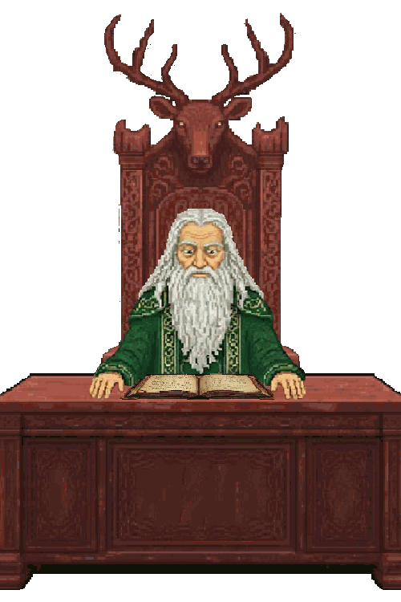
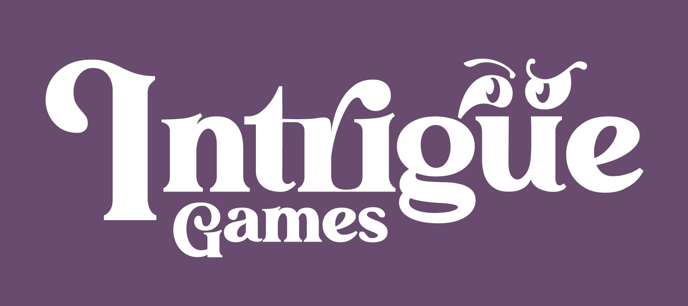

# Xal's Path

  

A story-driven clicker game designed in Unity, independently developed by Kevin Logan.

---

## About the Game

In **Xal's Path**, you embody a mysterious stranger summoned to a realm afflicted by a creeping blight. Your mission is to aid Xal, a determined druid, in a quest to cleanse the land and uncover the truth behind the corruption. 

The story delivers a morally complex narrative about perspective, power, and the relativity of good and evil. As you progress, you'll question who the real villain is, and you might find yourself looking in a mirror. The game combines thought-provoking storytelling with engaging clicker mechanics.

**Status:** *Xal's Path is no longer available on the App Store or Google Play. A heartfelt thank you to everyone who supported the game!* 

## Key Features

*   **Engaging Narrative:** A deep and mysterious story that unfolds as you progress.
*   **Clicker Mechanics:** Simple yet satisfying gameplay.
*   **Unique Art Style:** A distinct visual identity to immerse you in the world.
*   **Original Soundtrack:** A captivating soundtrack to accompany your journey. You can listen to it [here](https://www.youtube.com/watch?v=hDrSy_biKRo).

## Trailer

## The World of Xal's Path

Explore a realm teeming with magic and mystery. As you journey to lift the blight, you'll traverse several distinct areas:

*   **The Meadows:** Where your adventure begins.
*   **The Galia River:** Home to water and air-based creatures.
*   **The Sci Nai Mountains:** A treacherous range where powerful creatures dwell.
*   **Xal's Tower:** The secluded sanctuary of the druid Xal.
*   **The Sanctuary:** A safe haven for the creatures you rescue.

## Creatures of the Realm

The world is inhabited by a variety of mystical creatures, each affected by the encroaching blight. It's your job to find and cleanse them. Some of the creatures you'll encounter include:

*   Basilisk
*   Elk
*   Fire Horse
*   Griffin
*   Horse
*   Pegasus
*   Phoenix
*   Raiju
*   Thunder Horse
*   Unicorn
*   Void Spawn
*   Wisp
*   Wraith

## Development

This project was a solo endeavor, built from the ground up using the Unity Engine. It represents a significant personal milestone and a journey of passion and dedication to game development.

## Technical Snapshot

*   **Engine:** Unity
*   **Platform:** iOS & Android
*   **Language:** C#

## Links

*(Please note: As the game is no longer available, these links are for historical purposes and may be inactive.)*

*   **Developer Website:** [Intrigue Games](https://www.intrigue-games.com/)
*   **Original App Store Listing:** [iOS](https://apps.apple.com/us/app/xals-path/id1566474908)
*   **Original Google Play Listing:** [Android](https://play.google.com/store/apps/details?id=com.IntrigueGames.XalsPath)

---

*Property of Intrigue Games*
